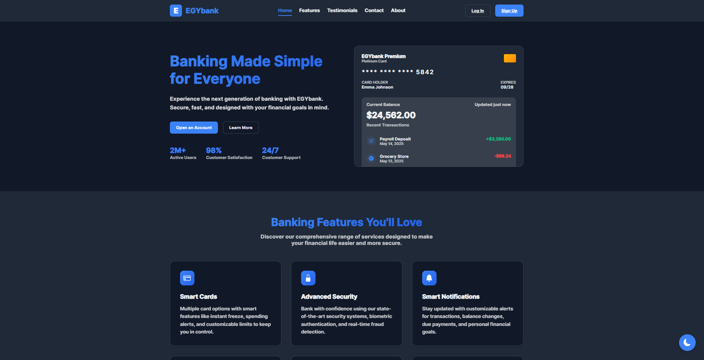

# EGYbank - Modern Banking Website

EGYbank is a comprehensive banking website with user and admin interfaces, offering a range of features for account management, transactions, and user profile customization.



## Table of Contents

- [Features](#features)
- [File Structure](#file-structure)
- [Pages](#pages)
- [User Roles](#user-roles)
- [Authentication](#authentication)
- [Transaction System](#transaction-system)
- [Theme Customization](#theme-customization)
- [Profile Management](#profile-management)
- [Admin Dashboard](#admin-dashboard)
- [Data Persistence](#data-persistence)
- [Responsive Design](#responsive-design)
- [Getting Started](#getting-started)

## Features

### Core Features

- **User Authentication**: Secure login and registration system
- **User Dashboard**: Personal banking dashboard with account overview
- **Transaction System**: Send and receive money between accounts
- **Admin Dashboard**: User management interface for administrators
- **Profile Management**: User profile with customization options
- **Theme Customization**: Multiple color themes and dark mode
- **Responsive Design**: Mobile-friendly interface for all devices

### User Features

- Account balance tracking
- Money transfer to other accounts
- Transaction history
- Profile picture upload
- Personal information management
- Password change functionality
- Theme customization (colors and dark mode)

### Admin Features

- User management (view, add, edit, delete)
- User search and filtering
- User status management
- Data persistence across page refreshes

## File Structure

```
EGYbank/
├── home.html                # Landing page
├── login_Register.html      # Authentication page
├── userpage.html            # User dashboard
├── admin_dashboard.html     # Admin dashboard
├── profile.html             # User profile page
├── script.js                # Main JavaScript for login/register
├── userpage.js              # JavaScript for user dashboard
├── admin_dashboard.js       # JavaScript for admin dashboard
├── profile.js               # JavaScript for profile management
└── style.css                # Main stylesheet
```

## Pages

### Home Page (`home.html`)

The landing page showcases EGYbank's services and features:
- Hero section with call-to-action
- Features section highlighting banking services
- Testimonials from satisfied customers
- Contact form for inquiries
- Footer with links and information
- Navigation to login/register page

### Login/Register Page (`login_Register.html`)

Authentication page with:
- Login form for existing users
- Registration form for new users
- Form validation
- Dark theme toggle
- Social login options (visual only)
- Smooth transition between login and register forms

### User Dashboard (`userpage.html`)

Personal banking interface with:
- Account balance display
- Account number information
- Money transfer functionality
- Transaction history
- Quick actions menu
- Navigation to profile page

### Admin Dashboard (`admin_dashboard.html`)

Administrative interface with:
- User management table
- User search and filtering
- Add, edit, and delete user functionality
- User status indicators
- Data persistence across refreshes
- Navigation to profile page

### User Profile (`profile.html`)

Profile management page with:
- Profile picture upload from local device
- Personal information update form
- Password change form
- Theme customization options
- Color theme selection
- Dark mode toggle

## User Roles

### Regular User
- Can access user dashboard
- Can send and receive money
- Can view transaction history
- Can manage personal profile
- Can customize theme preferences

### Admin User
- Can access admin dashboard
- Can manage all users
- Can view, add, edit, and delete users
- Can access all regular user features

## Authentication

The authentication system uses:
- Email and password validation
- Secure token generation
- Role-based access control
- Persistent login state
- Special admin credentials:
  - Email: ahmedsherif123@gmail.com
  - Password: ahmed112233

## Transaction System

The transaction system allows users to:
- Send money to other accounts
- View transaction history
- See transaction details (amount, recipient, date, description)
- Receive money (demo functionality)
- Track account balance

## Theme Customization

Users can personalize their banking experience with:
- Multiple color themes:
  - Default (Blue)
  - Green
  - Purple
  - Orange
  - Red
- Dark mode toggle
- Theme persistence across sessions
- Theme consistency across all pages

## Profile Management

The profile management system includes:
- Profile picture upload from local device
- Name and contact information updates
- Password change functionality
- Theme preference settings
- Data persistence across sessions

## Admin Dashboard

The admin dashboard provides:
- Complete user management
- User data table with sorting
- User search functionality
- Add new user capability
- Edit existing user details
- Delete user functionality
- User status management
- Data persistence across refreshes

## Data Persistence

The application uses localStorage for data persistence:
- User authentication state
- User profile information
- Transaction history
- Account balance
- Theme preferences
- Profile pictures (as base64 strings)
- Admin user management data

## Responsive Design

The website is fully responsive:
- Mobile-friendly layouts
- Adaptive navigation
- Flexible content containers
- Responsive forms and tables
- Touch-friendly interface elements

## Getting Started

1. Open `home.html` in a web browser to view the landing page
2. Navigate to the login/register page using the buttons in the header
3. Register a new account or use the admin credentials:
   - Email: ahmedsherif123@gmail.com
   - Password: ahmed112233
4. Explore the user dashboard or admin dashboard based on your role
5. Try sending money, updating your profile, or customizing your theme

---

This project is a front-end demonstration using HTML, CSS, and JavaScript with localStorage for data persistence. In a production environment, it would be connected to a secure backend server with a database for real data storage and processing.
