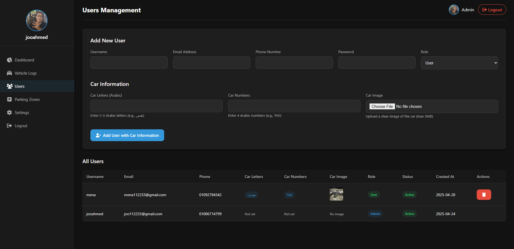

# Full-Stack Automatic Number Plate Recognition (ANPR) System


- [View the project python anpr logic on GitHub](https://github.com/Yousefa7medmaher/ANPR-CheckIn-Out-)
## Overview
This project is a full-stack Automatic Number Plate Recognition (ANPR) system designed to detect and process vehicle license plates. It uses Python, OpenCV for image processing, Roboflow for dataset management, and integrates with a PHP-based backend and a frontend built using HTML, CSS, and JavaScript. The project also includes a relational database for storing vehicle entry/exit logs, plate information, and more.

## Features
* **Vehicle Number Plate Recognition**: Detects and recognizes vehicle number plates using OpenCV and Roboflow.
* **Data Entry and Exit Logs**: Tracks and stores vehicle entry and exit times with an associated license plate.
* **Database Integration**: MySQL database stores vehicle records, entry logs, and other relevant data.
* **Web Interface**: A simple web interface to view and manage vehicle entry/exit logs.
* **User Authentication**: Secure login and admin panel to manage records.
* **Responsive Design**: Frontend built with HTML, CSS, and JavaScript, ensuring compatibility with various devices.

## Tech Stack
* **Backend**: PHP (Laravel)
* **Frontend**: HTML, CSS, JavaScript
* **Database**: MySQL (Relational Database)
* **Image Processing**: Python, OpenCV, Roboflow
* **Version Control**: Git, GitHub
* **Deployment**: Docker (optional for deployment)

## Setup Instructions

### Prerequisites
* **PHP**: Install PHP 7.4 or higher.
* **MySQL**: Set up a MySQL server.
* **Python**: Install Python 3.x.
* **OpenCV**: Install OpenCV for image processing.
* **Roboflow**: Create an account on Roboflow and get an API key to use their dataset for plate recognition.

### Step 1: Clone the Repository
```bash
git clone https://github.com/Yousefa7medmaher/ANPR-System.git
cd ANPR-System
```

### Step 2: Install Backend Dependencies
* Install PHP dependencies:
```bash
cd backend
composer install
```
* Set up the database:
   * Create a MySQL database.
   * Run the SQL script (`database.sql`) to set up the necessary tables.

### Step 3: Set Up Python Environment for Image Processing
* Create a Python virtual environment:
```bash
python -m venv venv
source venv/bin/activate  # For Windows use: venv\Scripts\activate
```
* Install required Python libraries:
```bash
pip install opencv-python roboflow mysql-connector-python
```
* Set up Roboflow API:
   * Get your API key from Roboflow.
   * Use the API to load your dataset for vehicle number plate detection.
* Image Processing Script: In the `python` directory, the script `process_image.py` performs the vehicle plate detection and logs it into the database.

### Step 4: Set Up Frontend
* The frontend consists of the following files:
   * `index.html` displays the vehicle logs and number plate recognition results.
   * `style.css` handles styling.
   * `script.js` contains the logic for front-end interactions.

### Step 5: Run the Project
* Start the Backend:
   * Start the PHP server using a local server:
```bash
php -S localhost:8000 -t public
```
* Start the Python Script:
   * Run the Python image processing script:
```bash
python process_image.py
```
* Access the Website:
   * Open your browser and navigate to `http://localhost:8000` to view the ANPR system in action.

## Usage
* **Admin Panel**: You can manage and view vehicle logs, track entries/exits, and update vehicle records.
* **Image Upload**: Upload vehicle images to process and extract number plate information.
* **Vehicle Entry/Exit**: Record the vehicle's entry and exit times along with the number plate recognition results.

## Future Enhancements
* **Real-Time Camera Integration**: Add live camera feed for real-time vehicle tracking and number plate recognition.
* **Mobile App**: Develop a mobile application using Flutter for accessing the ANPR system on mobile devices.
* **Enhanced Security**: Implement multi-factor authentication and stronger access control.

## Contributing
* Fork this repository.
* Create a new branch.
* Implement your changes.
* Submit a pull request.

## License
This project is licensed under the MIT License - see the LICENSE file for details.
